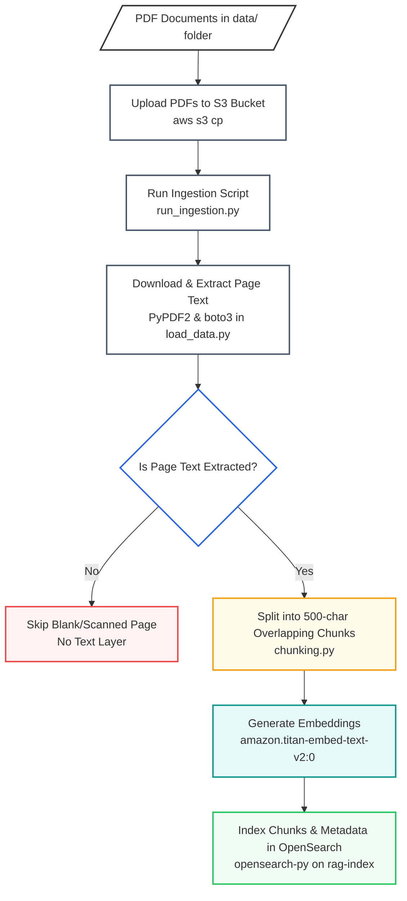
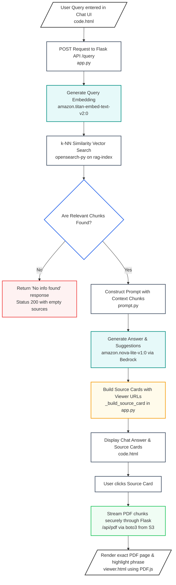
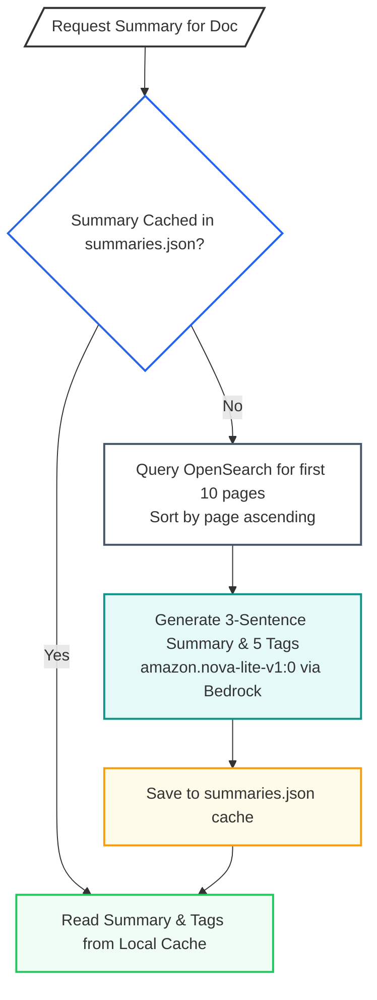

# AWS RAG Assistant

A document intelligence chatbot powered by **AWS Bedrock**, **OpenSearch**, and **S3**.  
Ask questions across multiple PDFs and get answers with exact page numbers, document names, and clickable source links.

---

## Project Structure

```
aws rag/
├── backend/                    # Python Flask API
│   ├── app.py                  # Main server — /query, /document routes
│   ├── config.py               # All configuration (S3 bucket, regions, models)
│   ├── requirements.txt        # Python dependencies
│   ├── run_ingestion.py        # Run once to ingest PDFs from S3
│   ├── setup_index.py          # Run once to create the OpenSearch index
│   │
│   ├── ingestion/              # Data pipeline
│   │   ├── load_data.py        # Downloads PDFs from S3, extracts page-level text
│   │   ├── chunking.py         # Splits pages into chunks with UUID + metadata
│   │   └── embed_store.py      # Embeds chunks and stores in OpenSearch
│   │
│   ├── retrieval/              # RAG query pipeline
│   │   ├── retriever.py        # k-NN vector search in OpenSearch
│   │   └── prompt.py           # Builds LLM prompt from retrieved chunks
│   │
│   └── utils/                  # AWS client helpers
│       ├── aws_clients.py      # Bedrock + S3 boto3 clients
│       └── opensearch_client.py
│
├── frontend/                   # UI
│   └── code.html               # Single-page chat interface
│
└── data/                       # Local copies of PDFs (upload these to S3)
```

---

## Setup & Run

### 1. Install dependencies
```bash
cd backend
pip install -r requirements.txt
```

### 2. Upload PDFs to S3
```bash
aws s3 cp ../data/ s3://rag-bot-jatin-001/data/ --recursive
```

### 3. Create OpenSearch index (one-time)
```bash
python setup_index.py
```

### 4. Ingest documents (one-time, or when PDFs change)
```bash
python run_ingestion.py
```

### 5. Start the server
```bash
python app.py
```

Open **http://localhost:5000** in your browser.

---

## How it works

1. **Ingestion** — PDFs are downloaded from S3, split into 500-char chunks (with page metadata + UUID), embedded via Amazon Titan, and indexed in OpenSearch.
2. **Query** — User question is embedded, top-5 matching chunks are retrieved from OpenSearch, passed to Amazon Nova Lite for an answer.
3. **Response** — Returns the answer + source cards with document name, page number, UUID, excerpt, and a pre-signed S3 URL to open the exact page.

---

## Tech Stack

| Layer | Service |
|---|---|
| LLM | Amazon Nova Lite (Bedrock) |
| Embeddings | Amazon Titan Embed Text v1 |
| Vector DB | Amazon OpenSearch Service |
| Storage | Amazon S3 |
| Backend | Python · Flask |
| Frontend | HTML · Tailwind CSS |

---

## System Workflows

### 1. Document Ingestion Workflow (Batch Processing)

This offline pipeline processes raw PDFs and indexes them into the vector database.



### 2. Query Retrieval & PDF Streaming Workflow (Real-Time)

This online pipeline handles user questions, executes semantic searches, generates answers, and streams highlighted sources.



### 3. Document Summarizer Workflow (Optional/On-demand)

This pipeline provides document-level summaries and dynamic tags on demand.


